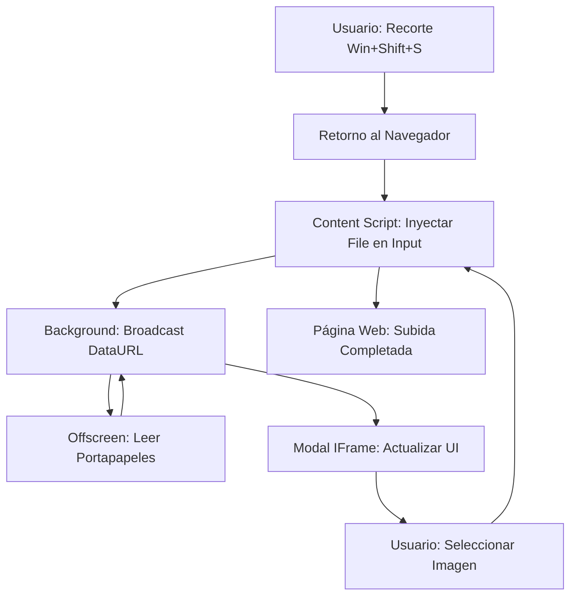

# Arquitectura Técnica de EasySS - v1.0.2

**EasySS** utiliza una arquitectura robusta de cuatro capas diseñada para maximizar la compatibilidad, saltar restricciones de seguridad (CSP) y ofrecer una experiencia de usuario instantánea sin comprometer la privacidad.

## Componentes del Sistema

### 1. Main World Script (`main_world.js`)
Inyectado directamente en el contexto de ejecución de la página web.
- **Misión**: Sobrescribir los prototipos nativos (`HTMLInputElement.prototype.click`).
- **Punto Clave**: Captura clics programáticos que ocurren dentro de frameworks como React, Angular o Vue, que de otro modo serían invisibles para los sensores normales.
- **Comunicación**: Notifica al `content.js` mediante `postMessage` cuando se intercepta una intención de subida.

### 2. Content Script (`content.js`)
El mediador principal y gestor de la interfaz en la pestaña activa.
- **Misión**: 
    - Escuchar clics físicos en el DOM (fase de captura) para interceptar subidas antes de que el navegador abra el explorador de archivos.
    - Gestionar el ciclo de vida del IFrame (Selector).
    - **Inyección de Archivos**: Convierte DataURLs en objetos `File` reales y los inyecta en el input usando `DataTransfer`.
    - **Memoria de Foco**: Rastrea el último elemento activo para permitir el "Pegado Instantáneo" en el modo Doble Shift.
- **Sensores**: Escucha eventos de `focus` y `visibilitychange` para disparar refrescos automáticos.

### 3. Background Service Worker (`background.js`)
El "cerebro" persistente de la extensión que coordina todas las pestañas.
- **Misión**: 
    - Gestionar el **Offscreen Document** para lectura universal del portapapeles.
    - **Captura Preemptiva**: Detecta clics derechos en imágenes y pre-procesa la captura antes de que el usuario abra el panel.
    - **Broadcasting**: Reenvía eventos de nuevas capturas a todos los componentes abiertos (pestañas y modales).
    - **Gestión de Descargas**: Accede a la API de `chrome.downloads` para mostrar archivos recientes.

### 4. Offscreen Document (`offscreen.html / .js`) - [NUEVO]
Una capa invisible que vive en el origen de la extensión.
- **Misión**: Leer el portapapeles de forma "privilegiada".
- **Bypass de Seguridad**: Al no ejecutarse dentro de la web host (como Instagram o Facebook), no está sujeto a sus políticas de seguridad (CSP). Esto permite capturar recortes de Windows incluso donde el sitio web intenta bloquearlo.
- **Técnica de Respaldo**: Utiliza un comando de pegado forzado (`execCommand`) sobre un elemento oculto para garantizar la captura en cualquier circunstancia.

### 5. IFrame del Selector (`modal.html / .js`)
Interfaz de usuario aislada y segura.
- **Almacenamiento**: Utiliza **IndexedDB** persistente. Todas las pestañas comparten la misma base de datos de capturas.
- **UI Dinámica**: Sistema de filas horizontales con scroll, badges de estado ("Nueva", "SS", "Copiado") y filtros de búsqueda.

## Flujo de Datos Maestro

## Seguridad y Permisos Críticos
- `offscreen`: Para lectura universal del portapapeles sin bloqueos.
- `clipboardRead`: Acceso legal a las capturas del sistema.
- `downloads`: Para integrar el historial de archivos descargados por el usuario.
- `contextMenus`: Para la captura rápida mediante click derecho.

---
*Última revisión técnica: 2026-04-28 - Versión 1.0.2*
