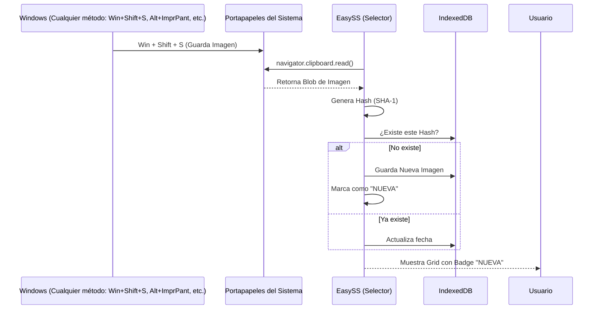

Este documento explica cómo **EasySS** identifica automáticamente las capturas de pantalla tomadas con cualquier herramienta nativa de Windows (`Win + Shift + S`, `Impr Pant`, `Alt + Impr Pant`, etc.) y cómo logra marcarlas como **"NUEVA"** en el selector.

## 1. Universalidad del Portapapeles de Windows

No importa qué método utilices para capturar tu pantalla:
- **`Win + Shift + S`**: Recorte personalizado.
- **`Impr Pant`**: Pantalla completa.
- **`Alt + Impr Pant`**: Solo la ventana activa.
- **`Ctrl + Alt + Impr Pant`**: Variantes de captura de ventana.

**¿Por qué funciona con todos?** Porque Windows, independientemente del atajo de teclado, deposita el resultado final como un objeto de imagen binaria en el **Portapapeles del Sistema**. EasySS no vigila tus teclas (por privacidad), sino que vigila el "contenedor" donde Windows deja las imágenes.

Cuando utilizas el atajo `Win + Shift + S`, Windows guarda la captura directamente en el portapapeles del sistema. EasySS aprovecha la API de Portapapeles de Chrome para "escuchar" y recuperar este dato sin intervención manual.

### El proceso técnico:
1. **Detección de Foco**: Cada vez que el selector de EasySS se abre o recupera el foco (por ejemplo, después de que terminas de hacer el recorte en Windows), se activa la función `checkClipboard()`.
2. **Lectura Asíncrona**: La extensión utiliza `navigator.clipboard.read()` para acceder a los datos binarios del portapapeles.
3. **Filtro de Tipo**: Se filtran los elementos para buscar específicamente tipos MIME que comiencen con `image/` (como `image/png`).

## 2. Identificación de Imágenes Únicas (Hashing)

Para evitar duplicar imágenes cada vez que abres el selector, EasySS implementa una lógica de "huella digital":

- **Función de Hash**: Se genera una firma única basada en los bits de la imagen utilizando el algoritmo **SHA-1**.
- **Comparación**: Antes de mostrar la imagen, la extensión consulta en su base de datos local (IndexedDB) si ya existe una imagen con ese mismo hash.
- **Actualización**: Si la imagen es idéntica a una existente, simplemente se actualiza su fecha para que aparezca primero. Si es distinta, se registra como una entrada nueva.

## 3. ¿Por qué aparece la etiqueta "NUEVA"?

La etiqueta **"NUEVA"** es un indicador visual de que la imagen en el portapapeles acaba de ser detectada y guardada por primera vez en esta sesión.

- **Detección de Cambio**: Cuando `checkClipboard()` detecta una imagen que no estaba en la base de datos, captura su **hash**.
- **Renderizado Dinámico**: Durante la creación del grid de imágenes, la función `renderImages` compara el hash de cada imagen con el "hash recién detectado".
- **Inyección de Badge**: Si coinciden, se añade el siguiente bloque de HTML:
  ```html
  <div class="badge-new">NUEVA</div>
  ```
  Esto permite al usuario identificar instantáneamente cuál es la captura que acaba de realizar.

## 4. Resumen del Flujo de Detección



## 5. Requisitos para que funcione
Para que esta detección sea exitosa, el navegador requiere:
- **Interacción del Usuario**: El usuario debe haber interactuado con la página al menos una vez (hacer clic en "Subir").
- **Permisos de Portapapeles**: La extensión debe tener el permiso `clipboardRead` declarado en el `manifest.json`.
- **Protocolo Seguro**: El sitio web debe estar corriendo bajo `https://`.
