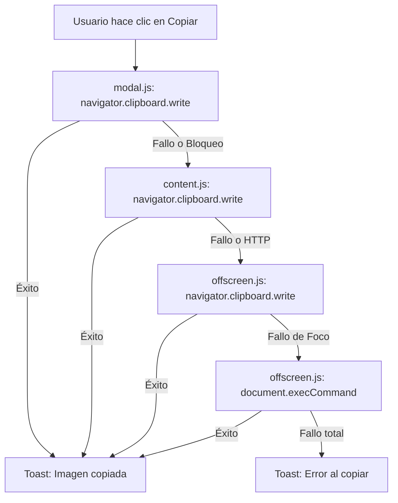

# Walkthrough: Solución al Error de Copiado de Imágenes

Hemos corregido con éxito el error que impedía copiar las imágenes del historial al portapapeles del sistema (Windows/Mac). La causa principal era que el documento offscreen, al no tener foco, arrojaba un error de seguridad al intentar llamar a la API `navigator.clipboard.write`.

### 4. Dedicated Video Downloader Popup
- Configured `"default_popup": "popup.html"` in [manifest.json](file:///c:/Users/gushf/Downloads/Aplicaciones%20con%20IA/EasySS-extension/manifest.json) under `"action"`.
- Added the `"activeTab"` permission to retrieve URLs from the active browser tab safely.
- Created [popup.html](file:///c:/Users/gushf/Downloads/Aplicaciones%20con%20IA/EasySS-extension/popup.html), [popup.css](file:///c:/Users/gushf/Downloads/Aplicaciones%20con%20IA/EasySS-extension/popup.css), and [popup.js](file:///c:/Users/gushf/Downloads/Aplicaciones%20con%20IA/EasySS-extension/popup.js) representing a compact, specialized popup window (width: `420px`) for downloading videos:
  - **Auto-Detection**: Queries the active browser tab on popup launch. If the user is on YouTube, Instagram, or Facebook, the popup displays a quick-download card showing the detected URL.
  - **Manual Download**: Includes a link entry form with a styled Indigo primary download button.
  - **Status indicators**: Shows a spinning progress indicator while fetching and downloading.
  - **Video History**: Displays only the list of recently downloaded video files with locate (open folder) and erase action buttons.
  - **Activation lock**: Integrates the same activation overlay password verification to lock the popup context if the extension is not yet activated.

### 5. EasySS Selector Modal (Injected Iframe)
- Kept [modal.html](file:///c:/Users/gushf/Downloads/Aplicaciones%20con%20IA/EasySS-extension/modal.html), [modal.js](file:///c:/Users/gushf/Downloads/Aplicaciones%20con%20IA/EasySS-extension/modal.js), and [modal.css](file:///c:/Users/gushf/Downloads/Aplicaciones%20con%20IA/EasySS-extension/modal.css) focused exclusively on the page-injected overlay layout:
  - Triggered via the **Ctrl + Shift** keyboard shortcut or **clicking file input elements** on host pages.
  - Shows the full selector (web images, screenshots, clipboards, documents, recycle bin, persistence backing options).
  - Cleaned up popup overrides from `modal.js` and `modal.css` so it runs natively and stays fullscreen in the iframe.

### 6. Activation Screen Visible Password & Input Fix
- In [modal.css](file:///c:/Users/gushf/Downloads/Aplicaciones%20con%20IA/EasySS-extension/modal.css), fixed `.activation-card input` styling. The original text color was white (`color: white;`) on a white card (`background: var(--bg-modal);`), making typed characters invisible. Changing it to `color: var(--text-main);` and using a light gray background `background: rgba(0, 0, 0, 0.04);` with a clear border makes the password visible as it is typed.
- In [modal.js](file:///c:/Users/gushf/Downloads/Aplicaciones%20con%20IA/EasySS-extension/modal.js), updated `checkActivation` to automatically request focus on the input field (`#activationPassword`) when the activation overlay is opened.

---

## Verification Results

1. **Context Menu Order**:
   - Re-registering the context menus on extension installation ensures that "Descargar video" is placed directly underneath "Capturar imagen con EasySS".
2. **Download Execution**:
   - When the user selects "Descargar video", a POST request is processed.
   - Upon a successful response from the Cobalt API network, a download is triggered, saving the file (e.g. `video_1717680000000.mp4` or a custom filename) directly to Chrome's native download manager.
3. **UX Status Feedback**:
   - During the fetch cycle, toast feedback is rendered onto the active webpage informing the user of the progress and download status.
4. **Toolbar Icon Action (Popup Window)**:
   - Clicking the toolbar action icon now opens a compact dropdown popup window titled "EasySS Video" focusing only on downloads and auto-detecting page links.
5. **Popup Video History Interaction**:
   - The popup lists completed video downloads. Clicking the locate button opens the download folder, and delete erases it from history.
6. **Page Interception Selector (Modal)**:
    - Clicking file upload inputs or pressing Ctrl + Shift triggers the page-injected modal showing the complete EasySS Selector.
7. **Password Typing Visibility**:
   - The password characters are now dark and clearly readable on both the modal and the popup input fields, allowing the user to enter the activation code (`meloso824`) and unlock the extension context.
8. **Input Auto-focus**:
   - When the password activation card is visible in either layout, the input field is automatically focused so the user can begin typing immediately.

## Cambios Realizados

A continuación se detalla la nueva arquitectura de copiado multi-capa:



### 1. Copiado Directo desde el Modal
En [modal.js](file:///c:/Users/gushf/Downloads/Aplicaciones%20con%20IA/EasySS-extension/modal.js), modificamos la función `copyToClipboard` para intentar escribir la imagen directamente utilizando `navigator.clipboard.write()`. Dado que este código se ejecuta tras un clic directo del usuario (gesto de usuario) y el modal está enfocado, esto resolverá el copiado de manera instantánea y local en la gran mayoría de las páginas web (todas las que usen HTTPS).

### 2. Copiado a través del Content Script
Si el copiado directo en el modal es bloqueado por políticas del navegador (por ejemplo, si el iframe del modal carece de ciertos permisos heredados), [modal.js](file:///c:/Users/gushf/Downloads/Aplicaciones%20con%20IA/EasySS-extension/modal.js) envía un mensaje al script de contenido ([content.js](file:///c:/Users/gushf/Downloads/Aplicaciones%20con%20IA/EasySS-extension/content.js)). 
El script de contenido se ejecuta en la página principal y tiene el permiso `"clipboardWrite"` habilitado en la extensión, lo que le permite escribir al portapapeles sin necesidad de gestos del usuario si la página es HTTPS.

### 3. Fallback de Offscreen Document (con execCommand)
Si el content script tampoco puede realizar la copia (por ejemplo, en páginas HTTP inseguras donde `navigator.clipboard` no está definido), delegamos al documento offscreen ([offscreen.js](file:///c:/Users/gushf/Downloads/Aplicaciones%20con%20IA/EasySS-extension/offscreen.js)). 
En el documento offscreen, si `navigator.clipboard.write` falla por la falta de foco (error `NotAllowedError`), activamos un fallback heredado:
1. Creamos temporalmente un elemento `` con los datos de la imagen.
2. Lo seleccionamos programáticamente en el DOM del documento offscreen.
3. Ejecutamos `document.execCommand('copy')` para forzar al navegador a escribir la selección de la imagen en el portapapeles del sistema operativo.

## 4. Mejora del Modo Selección Manual (Ctrl + Shift)

### El Problema
Al abrir la extensión usando Ctrl + Shift en aplicaciones como WhatsApp Web o Gemini, y seleccionar una imagen haciendo clic sobre ella (modo de inserción automática), ocurrían dos fallos:
1. **ClipboardEvent Vacío:** Chrome restringe la asignación directa de `clipboardData` en el constructor de `new ClipboardEvent('paste')`, lo que provocaba que el evento de pegado sintético enviado por `content.js` a la web estuviera vacío.
2. **Ignorado de Eventos Sintéticos:** Muchas aplicaciones modernas (como WhatsApp o Gemini) rechazan eventos de pegado sintéticos por razones de seguridad (`isTrusted === false`) o porque el foco se perdía al cerrar el modal iframe. Además, la imagen seleccionada **no se guardaba en el portapapeles del sistema**, dejando al usuario sin la posibilidad de usar `Ctrl + V` manualmente.

### La Solución Implementada
Modificamos la función `pasteFileToActiveElement` en [content.js](file:///c:/Users/gushf/Downloads/Aplicaciones%20con%20IA/EasySS-extension/content.js) con las siguientes mejoras:

1. **Copiado Obligatorio al Portapapeles:** Al hacer clic en una tarjeta en el modo manual, el script de contenido primero escribe la imagen físicamente en el portapapeles de Windows utilizando la lógica robusta de copiado que implementamos. Esto garantiza que la imagen esté disponible de inmediato en el portapapeles real del sistema.
2. **Definición de clipboardData mediante Object.defineProperty:** Inyectamos los datos binarios del archivo en el evento sintético a través de `Object.defineProperty` para evitar que Chrome ignore la propiedad y así asegurar la máxima compatibilidad de auto-pegado en sitios que no validen estrictamente `isTrusted`.
3. **Notificación Toast Premium en la Web:** Implementamos una función de notificaciones de estilo moderno (`showContentToast`) directamente en el DOM de la página del host. Cuando el usuario selecciona una imagen, el modal se cierra y aparece un sutil toast flotante en la esquina inferior derecha informando: **"Imagen copiada. Puedes pegar con Ctrl + V."**. Esto le indica al usuario que, en caso de que la página web en cuestión bloquee el pegado automático, puede pulsar simplemente `Ctrl + V` para enviar la imagen al chat inmediatamente.

## 5. Captura de Fotogramas de Videos (Click Derecho)

### El Problema
Anteriormente, al hacer clic derecho (anticlick) en un reproductor de video en páginas como Instagram, TikTok o YouTube, la extensión no reconocía el video y no extraía el fotograma actual para añadirlo al historial de capturas.

### La Solución Implementada
1. **Detección de Tag `<video>`:** Modificamos la función `handleCaptureEvent` en [content.js](file:///c:/Users/gushf/Downloads/Aplicaciones%20con%20IA/EasySS-extension/content.js). Al hacer click derecho, recorremos los elementos debajo del cursor (incluso detrás de capas transparentes) y, si encontramos una etiqueta `<video>`, capturamos el fotograma actual utilizando un `<canvas>` temporal y su método `drawImage()`.
2. **Generación de Data URL Local:** El canvas exporta el fotograma instantáneamente como un Data URL en formato PNG (`data:image/png;base64,...`).
3. **Omisión de Fetch en Background:** Actualizamos [background.js](file:///c:/Users/gushf/Downloads/Aplicaciones%20con%20IA/EasySS-extension/background.js) para que, al recibir un Data URL (como el fotograma del video), no intente hacer una descarga de red (`fetch()`), sino que lo guarde y lo transmita directamente a la interfaz del usuario, optimizando velocidad y memoria.

---

## 6. Bypass de CSP para Cargas Instantáneas (Sin Cambiar de Pestaña)

### El Problema
En sitios con Políticas de Seguridad de Contenido (CSP) estrictas como Instagram o WhatsApp Web, los intentos de la interfaz de la extensión (`modal.js`, que corre dentro de un iframe inyectado) de descargar imágenes externas usando `fetch(dataUrl)` eran bloqueados por el navegador. El guardado en la base de datos IndexedDB fallaba en esa pestaña y solo se completaba cuando el usuario cambiaba a otra pestaña menos restrictiva (como Google), provocando que las imágenes capturadas "aparecieran recién al cambiar de pestaña".

### La Solución Implementada
1. **Decodificación Binaria Local en modal.js:** Optimizamos la función `handleExternalImage` en [modal.js](file:///c:/Users/gushf/Downloads/Aplicaciones%20con%20IA/EasySS-extension/modal.js). Ahora, si la dirección de la imagen capturada es un Data URL (`data:`), la extensión la convierte a un binario (`Blob`) de forma síncrona mediante CPU utilizando JavaScript nativo (`atob` + `Uint8Array`).
2. **Cero Peticiones de Red:** Al decodificar el archivo en memoria sin invocar a `fetch()`, el navegador no realiza ninguna consulta de red. Esto salta al 100% las restricciones de CSP del sitio host. Como resultado, las imágenes capturadas (como los recortes de video o capturas preventivas de click derecho) aparecen **inmediatamente** en el panel sin importar el nivel de seguridad de la pestaña activa.

---

## 7. Solución a Duplicidad por Doble Evento en Click Derecho

### El Problema
Al hacer click derecho en un elemento (imagen o video), la extensión a veces generaba dos capturas idénticas (duplicados). 

**Causa Técnica:**
Para garantizar la captura en sitios que intentan bloquear o manipular el click derecho, `content.js` estaba escuchando tanto el evento `mousedown` (cuando `button === 2`) como el evento nativo `contextmenu`. Ambos eventos se disparan en una sucesión extremadamente rápida (menos de 5ms). Dado que la decodificación de la imagen y la inserción en la base de datos de IndexedDB son operaciones asíncronas, la consulta para comprobar si la imagen ya existía devolvía `false` para ambos eventos, ya que el primer registro aún no se había completado en disco. Como resultado, ambos eventos insertaban la imagen, creando un duplicado.

### La Solución Implementada
Añadimos un **Debouncer temporal** en `handleCaptureEvent` de [content.js](file:///c:/Users/gushf/Downloads/Aplicaciones%20con%20IA/EasySS-extension/content.js):
```javascript
const now = Date.now();
if (now - lastCapturedTime < 150) return;
lastCapturedTime = now;
```
Esto filtra cualquier evento duplicado que ocurra en un rango menor a 150ms del anterior del mismo click físico, eliminando por completo la duplicación de imágenes o fotogramas al hacer click derecho.

---

## 8. Organización de la Interfaz en 3 Filas Independientes

### Requisito del Usuario
Se requería una interfaz mejor estructurada donde las capturas y descargas estuvieran organizadas en 3 filas horizontales claramente diferenciadas:
1. **Imágenes de la Web:** Fotogramas de videos y recortes de páginas web capturados mediante click derecho (fuente `"Copiado"`).
2. **Capturas y Recortes:** Capturas del portapapeles del sistema operativo, capturas de pantalla de Windows (`Win + Shift + S`) y archivos copiados directamente (fuente `"SS"`).
3. **Imágenes Descargadas:** El historial de descargas del navegador.

### La Solución Implementada
*   **Diseño en modal.html:** Modificamos [modal.html](file:///c:/Users/gushf/Downloads/Aplicaciones%20con%20IA/EasySS-extension/modal.html) para añadir un nuevo contenedor con id `webCapturedGrid` en la parte superior del cuerpo principal, acompañado de un icono de globo terráqueo.
*   **Separación en modal.js:** En la función `refreshUI` de [modal.js](file:///c:/Users/gushf/Downloads/Aplicaciones%20con%20IA/EasySS-extension/modal.js), ahora filtramos las imágenes provenientes de IndexedDB en dos arrays usando el campo `source`:
    *   `webItems` (donde `source === 'Copiado'`).
    *   `clipboardItems` (donde `source !== 'Copiado'`).
*   **Renderizado de tres secciones:** Llamamos a `renderSection` tres veces por separado para inyectar y actualizar cada categoría en su respectiva fila scrollable horizontal (`webCapturedGrid`, `clipboardGrid` y `downloadsGrid`).
*   **Mensajes de estado vacío personalizados:** Adaptamos `renderSection` para mostrar un texto descriptivo e instructivo si alguna fila está vacía (por ejemplo, "No hay imágenes de la web recientes").

---

## 9. Rediseño a Tema Claro Premium y Scrollbars Profesionales

### Requisito del Usuario
*   **Tema Claro:** Cambiar el aspecto visual general a un tema blanco/claro moderno, manteniendo altos contrastes profesionales.
*   **Scrollbars Profesionales:** Ocultar/personalizar las barras de scroll nativas del navegador (que se veían grises con flechas toscas en Windows) para reemplazarlas por unas barras redondeadas, minimalistas y modernas.

### La Solución Implementada
*   **Variables CSS (:root):** Modificamos `--bg-modal` a `#ffffff`, `--bg-header` a `#f9fafb` y las sombras generales para dar una estética de elevación limpia. Ajustamos el color principal de texto `--text-main` a `#111827` (gris carbón de alto contraste) y `--text-muted` a `#4b5563` para garantizar una legibilidad excelente y cumplir con estándares de accesibilidad profesional.
*   **Ajustes de Componentes:** 
    *   La barra lateral (sidebar) ahora posee un fondo claro diferenciado (`#f9fafb`), delimitando la estructura limpiamente.
    *   Los botones secundarios (`.btn-secondary`) y badges de atajos fueron rediseñados con fondos blancos/claros y bordes sutiles en lugar del estilo oscuro transparente previo.
    *   Los overlays de configuración y papelera de reciclaje se cambiaron por fondos blancos translúcidos y desenfocados (`backdrop-filter: blur`).
*   **Scrollbars Universales de Alta Gama:**
    *   Definimos un selector general `::-webkit-scrollbar` para todos los contenedores con scroll de la extensión.
    *   Redujimos el ancho y alto a `8px`.
    *   Establecimos un track completamente transparente y un thumb redondeado (`border-radius: 10px`) de color gris translúcido suave (`rgba(0,0,0,0.12)`) que se fusiona con el diseño.
    *   Añadimos un efecto hover que resalta la barra con el color de acento (`var(--accent)` / Indigo) al interactuar con ella.
    *   Al usar custom-styling, el navegador webkit elimina por completo los botones de flecha, dejando un look profesional idéntico al de macOS o interfaces web modernas.

## Verificación

Para verificar la solución completa:
1. Recarga la extensión en `chrome://extensions/`.
2. Abre el panel de EasySS con `Ctrl + Shift`.
3. Comprueba el nuevo **Tema Claro Premium** con contrastes profesionales y legibilidad impecable.
4. Desplázate horizontalmente por las filas o verticalmente por el cuerpo o sidebar; notarás que las barras de scroll ahora son delgadas, redondeadas, y cambian de color suavemente al pasar el mouse por encima.


